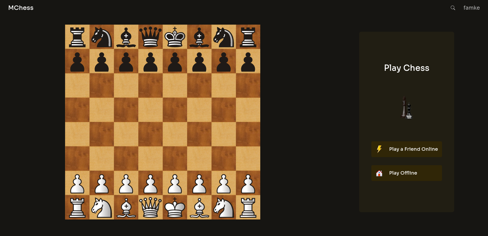
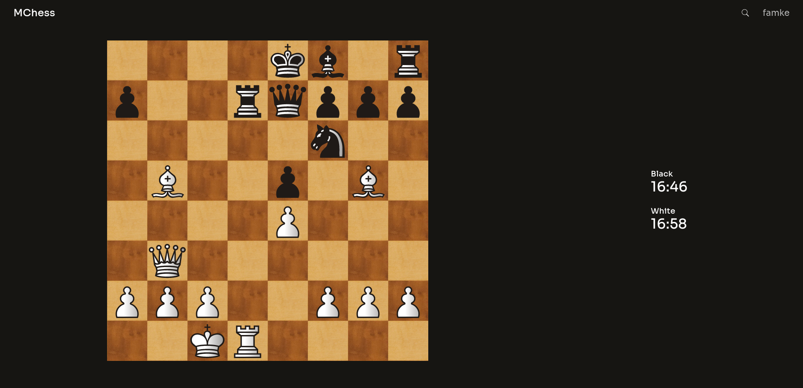
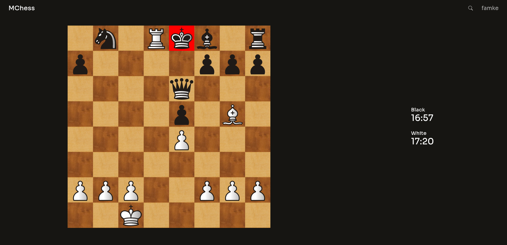

# MChess

A chess app with multiplayer functionality built with ReactJS and FastAPI.

## Run Locally

Clone the project

```bash
  git clone https://github.com/milkias17/chess
```

Go to the project directory

```bash
  cd chess
```

Install dependencies

```bash
  pip install -r requirements.txt
  cd frontend
  npm install
```

Start the backend server

```bash
  uvicorn backend.main:app --reload
```

Start the frontend server

```bash
  cd frontend
  npm start
```

## Screenshots




# MChess
# mMChess
